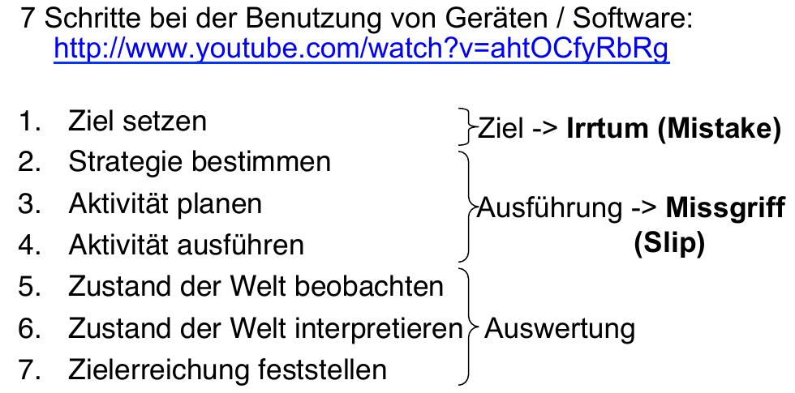

=======================
FS14 UInt2 Exam Summary
=======================

Dieses Dokument beinhaltet den Stoff, der in den Closed-Book Teilen von alten Prüfungen vorkam.


1 Begriffe
==========

Cognitive Walkthrough
	Auch  Heuristische (Usability) Analyse oder Expert (Usability) Review
	
Future Storyboard
	Soll Szenario
	
Szenario
	Enthält mindestens:
	* Benutzer (Hauptdarsteller)
	* Kontext
	* Auslöser
	* Ziel 
	* Problem welches die Zielerreichung erschwert
	* Schritte
	* Ergebnis (Ziel erreicht ja/nein)
	
AIDA
	* Wie bringt man den Kunden dazu zu kaufen?
	* „Attention“ (Aufmerksamkeit), „Interest“ (Interesse), „Desire“ (Wunsch), „Action“ (Handlung)
	
Artefakte/Dokumente
	* Problems & Tasks (Was sind die Probleme und warum)
	* Usability Test (Ausgangslage, Instruktionen, Aufgaben)
	* Usability Test Log (Testergebnisse)
	* Test Report (Zusammengefasste Ergebnisse. Validierte/nicht validierte Probleme, neue Probleme)
	* Cognitive Walkthrough (Getestetes Produkt, Benutzerprofile/Rollen, Aufgaben, Probleme)
	* Redesign (Wireframes)
	* Fazt (Einleitung, Projektstand, Vorgehen & Verbesserungen, Tools, Lessions Learned, Ausblick)
	
Interview
	* Contextual Inquiry = Feldforschung = Ethnographic Inteview = Ethnographisches Interview (Fälle beobachten -> Daten)
	* Stakeholder = Betroffene Person = Auftraggeber, Benutzer, indirekte Nutzer (Meinungen von Sponsoren, Benutzer identifizieren)

Safety-Critical System / Life critical system
	* Tod oder Lebensgefährdung von Personen
	* Verlust oder Beschädigung von Anlagen
	* Kontaminieren / Beschädigung der Umwelt/Umgebung
	

2 Richtlinien / Regeln
======================

Garrett 5 „Phasen“ Model mit Mapping zu HCID Disziplinen
------------------------------------------------------------

.. image:: img/1.2.jpg
   :width: 80 %

.. image:: img/1.3.jpg


Usability Engineering Vorgehensmodel (UCD Prozess)
--------------------------------------------------

.. image:: img/3.1.jpg
   :width: 80 %
   :align: left


Goodwin: UCD Phasen
-------------------


Schneidermann: 8 goldene Regeln des Dialog Designs
--------------------------------------------------

* Strebe nach Konsistenz:
  Interne und externe Konsistenz
* Ermögliche es häufigen Nutzern, Abkürzungen zu benutzen:
  Experten und Anfänger unterstützen. Accessibility
* Biete informative Rückmeldungen:
  Feedback über laufende Funktionen oder den Systemstatus.
* Entwerfe abgeschlossene Dialoge:
  Klar machen wann eine Funktion/Befehlskette abgeschlossen ist.
* Biete einfache Fehlerbehandlung:
  Informationen zur Fehlersituation; Auswege.
* Erlaube einfache Umkehrung von Aktionen:
  Undo-Funktion
* Unterstütze interne und lokale Kontrolle:
  Benutzer fühlt sich in Kontrolle
* Verringere Abfragen des Kurzzeitgedächtnisses:
  Anzeigen statt Abfragen


Nielson Kriterien zur heuristischen Evaluation von UI's
-------------------------------------------------------

1) Sichtbarkeit des System-Status
2) Enger Bezug zwischen System und realer Welt
3) Nutzerkontrolle und Freiheit
4) Konsistenz & Konformität mit Standards
5) Fehler-Vorbeugung
6) Besser Sichtbarkeit als Sich-erinnern-Müssen
7) Flexibilität und Nutzungseffizienz
8) Ästhetik und minimalistischer Aufbau
9) Nutzern helfen, Fehler zu bemerken, zu diagnostizieren und zu beheben
10) Hilfe und Dokumentation


Grudin: Design Challenges
-------------------------


Norman Action Cycle
-------------------


   

   
.. image:: img/2.1.jpg
   :width: 60 %
   :align: left
   
   
Luke Wroblewsky: Web Formular Design Best Practices
---------------------------------------------------


3 Standards
===========

Farbpaletten
------------


.. figure:: img/Triangulo_HSV.png
   :width: 40 %
   
   HSI Farbwähler

   
Maslow Pyramid
--------------

::

	                  .-.
                      .-`    `-.
                  .-`           `-.
               .-`                 `-.
              / ````````````````````` \
	     /   Selbstverwirklichung  \
	    /    Soziale Anerkennung    \
	   /     Soziale Beziehungen     \
	  /           Sicherheit          \
	 / physiologische Grundbedürfnisse \
	/___________________________________\
	

Mihaly Csikszentmihalyi: Game Theory (Flow)
-------------------------------------------


