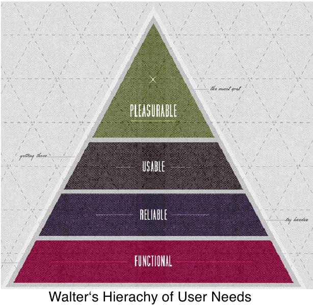
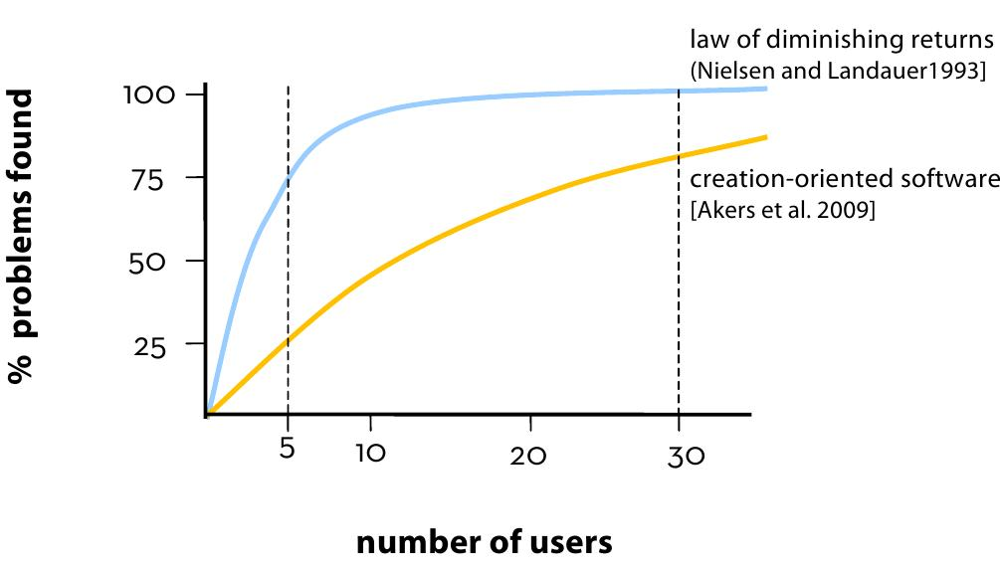

============
FS14 Summary
============

0 Allgemeines
=============

* Prüfung halb-halb open/closed Book
* Miniprojekt 1/3, Prüfung 2/3
* Books: ui214

1 UCD
=====

* User Centered Design
* Usability, Human Computer Interaction

1.1 User experience vs Usability
--------------------------------

* User Experience vs. Usability User Experience umfasst mehr als „nur“ die Interaktion mit einem IT Produkt
* Usability beschäftigt sich vor allem mit dem oberen Teil der Pyramide

1.2 5 „Phasen“ Model von Garrett
--------------------------------

.. image:: img/1.3.jpg

   5 Phasen Model von Garrett

   
* Bsp: Die Entscheidung für eine bestimmte Navigation schränkt die Wahlmöglichkeiten auf der Ebene höher ein.

   Entscheidungen auf einer Ebene definieren Design Optionen auf anderen Ebenen

   Garret Iterationen, die nötig sind um Benutzerbedürfnisse zu treffen

2 Heuristische Usability Evaluation
===================================

* Summative Evaluation: Testen eines bestehenden Systems
* Testen während Entwicklung: Formativer Test (während es geformt wird)
* Methoden
	* heuristisch
		* Styleguide Review
		* Cogn. Walkthrough
	* empirisch
		* Usability Test
		* Fragebögen

.. figure:: img/1.7.jpg

   Gebrauchstauglichkeit

2.1 Kriterien für die Heuristische Evaluation von GUIs nach Nielsen
-------------------------------------------------------------------

1) Sichtbarkeit des System-Status
2) Enger Bezug zwischen System und realer Welt
3) Nutzerkontrolle und Freiheit
4) Konsistenz & Konformität mit Standards
5) Fehler-Vorbeugung
6) Besser Sichtbarkeit als Sich-erinnern-Müssen
7) Flexibilität und Nutzungseffizienz
8) Ästhetik und minimalistischer Aufbau
9) Nutzern helfen, Fehler zu bemerken, zu diagnostizieren und zu beheben
10) Hilfe und Dokumentation

**Prüfung**: Kriterien von "Shneiderman (Ben)", "Kriterien von Stone et al 2005 (User Interface Design and Eva",  "Jeff Johnson Guidelines" und "Regeln aus Norman DOET" anschauen

2.2 Cognitive Walkthrough
-------------------------

CW hilft nicht erfüllte Usability Kriterien zu finden.

.. figure:: img/1.8.jpg

   Cognitive Walkthrough Durchführung

* Cognitive Walktrough testet die Qualität derStruktur von Interaktion (Action Cycle nach Norman)
	1. Ziel setzen" Ziel -> Irrtum (Mistake)
	2. Strategie bestimmen"
	3. Aktivität planen" Ausführung -> Missgriff
	4. Aktivität ausführen" (Slip)
	5. Zustand der Welt beobachten"
	6. Zustand der Welt interpretieren" Auswertung
	7. Zielerreichung feststellen"

* Kann der Benutzer herausfinden, ob die Aktion das bewirkt hat, was ich wollte?

3 UCD Prozess
=============

   UCD Norm
   
   
3.1 Szenarios
-------------

   

4 Usability Testing
===================

Test Vorgehen
-------------

* Benutzergruppe festlegen
* Instruktionen definieren

   Usability Test Vorgehen

Test Mistakes
-------------

* Falsche Personen eingeladen
* System läuft nicht
* One-Way-Mirror (Spiegel macht Benutzer nervös), Kamera besser
* Im Vorfragebogen keine Fragen stellen, die den UT beeinflussen (mögen Sie rote Knöpfe?)
* Externe Einflüsse vermeiden

Testing
-------

   Usability Testing mit Eye Tracking (Heute Eye Tracker in unterem Display Rand versteckt)

   5 Personen reichen aus um 75% der Fehler zu finden

* Creation Oriented Software: z.B. CAD mit vielen Optionen wie Rechtsklick und Kontextabhängigen Operationen

A/B Testing
-----------

* Zwei Versionen des **Live** Systems werden gegeneinander getestet
* Klappt nur bei best. System mit genügend Nutzer und bei kleinen Änderungen
   

5 Innovation
============

.. note:: Innovation heisst nicht nur Erfinden sondern auch ein Lauffähiges und praxistaugliches Produkt zu haben -> Es spielt keine Rolle, wer es erfunden hat.

   Innovation kann in allen Bereichen stattfinden

* Einordung Elemente Garret:
	* Benutzer: Strategie
	* Aufgabe: Features
	
.

   Design Thinking: Design Thinking: Innovation muss auch die Möglichkeiten des Business miteinbeziehen, bzw. kann auch „nur“ eine Business-Innovation sein

* Innovationsprozess des Design Thinking ähnelt dem UCD

Warum setzt sich Technologie durch / nicht durch?
-------------------------------------------------

Produkte müssen folgende Punkte erfüllen:

* Muss mit nicht-Experten funktionieren
* Billig herzustellen, Haltbarkeit (nicht gleich kaputt gehen)
* Spricht einen aktuellen Bedarf von Nutzern an (z.B. User wollen Kommunizieren) -> Benutzer müssen auch gewillt sein ihr Verhalten zu ändern da das aktuelle Produkte Probleme verursacht
* Keine aufwendige/neue Infratruktur/andere Nutzer vorausgesetzt (Effizienz der Infrastruktur beeinflusst Marktdurchdringung)
	.. image:: img/5.4.jpg
	
* Kein Erfordernis bestehende Software umzuschreiben (z.B: Kinect, das nicht ohne Weiteres als Maus Alternative eingesetzt werden kann)
* Management muss die Idee supporten

6 Konkurrenz Analyse
====================

* Nutzertanalyse (Produktevergleich)
* Kunst ist, die Konkurrenz zu definieren

Kano Analyse
------------

* Basiseigenschaften
* Leistungseigenschaften
* Begeisterungseigenschaften

