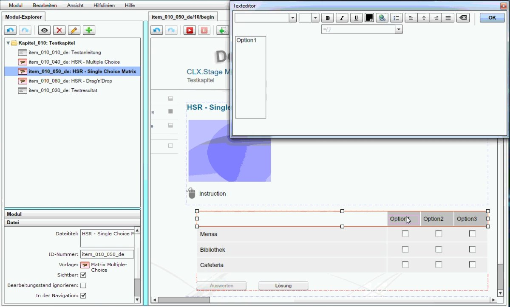
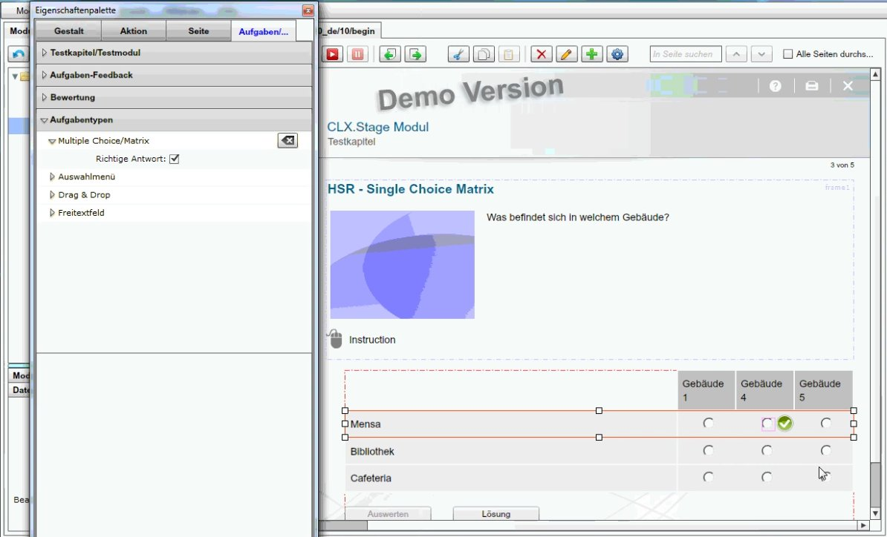

=========================================
UI2 FS2014 DropTable Cognitive Walktrough
=========================================

:Gruppe: DropTable
:Teilnehmer: Tobias Blaser, Philipp Christen
:Email: tblaser(at)hsr.ch, pchriste(at)hsr.ch

1 Getestetes Produkt
====================

`CLX.Stage`_: Editor für Stage E-Learning System der Firma CREALOGIX AG

.. _CLX.Stage: http://www.crealogix.com/produkte/education-produkte-fuer-firmenkunden/autorensysteme/clxstage/

Es werden nur Aufgabenseiten getestet, keine Infoseiten.

2 Benutzerprofile
=================

2.1 Autor
----------

Autoren erstellen Module und deren Inhalte.

2.2 Anwender (Teilnehmer)
-------------------------

Teilnehmer bearbeiten die Lerninhalte, beantworten dabei auftauchende Fragen und sehen sich die Auswertungen an.

2.3 Weitere
-----------

Neben den Autoren und Teilnehmern gibt es noch Kursleiter, welche für die Ausführung und Auswertung der Lerninhalte zuständig sind. Diese fallen aber nicht in den Rahmen dieser Untersuchung. Zudem kommt es vor, dass Autoren gleichzeitig auch Kursleiter sind, insbesondere in Schulen.
 
3 Aufgaben und Probleme
=======================

**Voraussetzung:** CLX.Stage wurde korrekt installiert und gestartet.

Kategorisierung der Probleme gemäss **STONE** et al. (2005):

1) Visibility : First step to goal should be clear 

2) Affordance : Control suggests how to use it

3) Feedback : Should be clear what happened or is happening

4) Simplicity : As simple as possible and task-focused

5) Structure : Content organized sensibly

6) Consistency : Similarity for predictability

7) Tolerance : Prevent errors, help recovery

8) Accessibility : Usable by all intended users, despite handicap, access device, or environmental conditions

oder 

**NIELSEN** und Mollich (1990):

1) Consistency and standards

2) Visibility of system status

3) Match between system and real world

4) User control and freedom

5) Error prevention

6) Recognition rather than recall

7) Flexibility and effiency of use

8) Aesthetic and minimalist design

9) Help users recognize, diagnose, and recover from errors

10) Provide online documentation and help

**Schritte**

Video: http://www.mediafire.com/watch/7br4m5fj37u69s8/screenrecording_clx_stage_UINT2.wmv

1) Neuen Kapitelinhalt anlegen
2) Kategorie auswählen
3) Element auswählen
	
**Inhaltstypen**

1) Multiple Choice
2) Single Choice Matrix
3) Drag-Drop

3.1 Lerninhalte erstellen
-------------------------

Ausgangspunkt für den Autor ist das geöffnete Programm ohne geladenes Modul.

.. figure:: stepScreens/3.0.Ausgangslage_Autor.png

3.1.1 Modul erstellen
.....................

1) Menu Modul / Modul neu erstellen

* **Problem:** Dem Autor ist nicht klar, was er jetzt machen soll. (STONE 1)
	* **Grund:** Es wird kein Hilfetext angezeigt oder gar eine prominente Schaltfläche.

	1) Vorlagenauswahl wird angezeigt

	.. figure:: stepScreens/3.1.1_2.Templateauswahl.png

2) Bei der Vorlagenauswahl im Akkordeon zu den Testmodulen wechseln

3) Ordner auswählen, wo das Modul gespeichert werden soll, Auswahl bestätigen.

* **Problem:** Es ist nicht klar, warum jetzt bereits ein Ordner ausgewählt werden muss, obwohl noch kein Content erstellt wurde (STONE 4)

	1) Neues Modul wird erstellt und geöffnet. Es wurden automatisch eine Startseite, eine Aufgabenseite und eine Auswertungsseite erstellt.

	.. figure:: stepScreens/3.1.1_5.neues_modul.png

	* **Problem:** Es werden potentiell unerwünschte Seiten (mit Inhalt) erstellt und der Autor wurde nicht darauf hingewiesen. (STONE 3)

4) Im Modul-Explorer das Kapitel aufklappen und die bestehende Aufgabenseite löschen.

	1) Seite anwählen und auf den Löschbutton klicken.

	.. figure:: stepScreens/3.1.1_6.bestehende_seite_loeschen.png

	* **Problem:** Es ist nicht ganz klar, welcher Löschen-Button die gewünschte Funktion auslöst. (STONE 1)
		* **Grund:** Es gibt zwei identische Löschen-Buttons.

	2) Löschvorgang bestätigen

	.. figure:: stepScreens/3.1.1_7.loeschen_bestaetigen.png

3.1.2 Seiten anlegen
....................

1) Über den Button (+) die Seitenvorlagen öffnen.

* **Problem:** Es ist nicht ganz klar, welcher Button die gewünschte Funktion auslöst. (STONE 1)
	* **Grund:** Es gibt zwei identische Buttons für das Hinzufügen (einer für Seiten/Kapitel, einer für Elemente).

2) Im Akkordeon der Seitenvorlagen zu den Aufgabenseiten wechseln

* **Problem:** Autor muss Aufgabenseiten explizit auswählen, obwohl er sich in einem Testkapitel befindet. (STONE 4)
	
3) Die Vorlage "Multiple Choice (mit Auswerten-Button)" suchen.

* **Problem:** Autor wird leicht verwirrt.
	* **Grund:** Es gibt viele Vorlagen, welche teilweise sehr ähnliche Namen haben. (STONE 5)

	1) Die Vorlage in den Modul-Explorer ziehen.

	.. figure:: stepScreens/3.1.2_3.MultipleChoice_erstellen.png

	* **Problem:** Autor weiss nicht, wie er die gewählte Vorlage einfügen soll. (STONE 2)
		* **Grund:** Es existiert keine Schaltfläche.

4) Die Vorlage "Matrix Multiple Choice (mit Auswerten-Button)" suchen.

* **Problem:** Autor kann keine Seite vom Typ "Matrix Single Choice" wählen. (STONE 4)
	* **Grund:** Diese existiert nicht, weil die Unterscheidung Multiple/Single erst später auftaucht.

	1) Die Vorlage in den Modul-Explorer ziehen.

	.. figure:: stepScreens/3.1.2_4.MatrixMultipleChoice_erstellen.png

5) Die Vorlage "Drag & Drop mit Text (mit Auswerten-Button)" suchen.

	1) Die Vorlage in den Modul-Explorer ziehen.

	.. figure:: stepScreens/3.1.2_5.Drag_n_Drop_erstellen.png

6) Seitenvorlagen schliessen

.. figure:: stepScreens/3.1.2_6.Vorlagen_schliessen.png

3.1.3 Multiple Choice-Seite bearbeiten
......................................

1) Seite durch Doppelklick im Modul-Explorer öffnen

* **Problem:** Es ist unklar, wie die Seite geöffnet werden kann  (STONE 1)
	* **Grund:** Der Öffnen-Button (Auge) hat den Hovertext "Ordner öffnen"

2) Titel der Seite ändern

* **Problem:** Es ist nicht klar, dass "Dateititel" gleichzeitig der Seitentitel ist. (STONE 1)

3) Seite in der Navigation sichtbar machen via Checkbox

4) Aufgabentext ändern durch Doppelklick auf Textelement

* **Problem:** Autor könnte versuchen, das Element zu markieren und Text direkt einzugeben oder sogar den Text zu markieren (STONE 4)

	1) Texteditor durch Klick auf OK schliessen

5) Optionen abändern durch je einen Doppelklick auf die entsprechende Option

	1) Texteditor jeweils durch Klick auf OK schliessen

.. figure:: stepScreens/3.1.3_5.alle_texte_geändert.png

6) Auswerten-Button löschen via Löschen-Button (X)

* **Problem:** Unklar, warum ein Auswerten-Button überhaupt in einem Testkapitel erscheint. Kann vergessen gehen und Probleme beim Abspielen verursachen (STONE 7)

	1) Löschen mit OK bestätigen

	.. figure:: stepScreens/3.1.3_6_1.Loeschen_bestaetigen.png

7) Lösungs-Button löschen via Löschen-Button (X)

* **Problem:** Unklar, warum ein Lösungs-Button überhaupt in einem Testkapitel erscheint. Kann vergessen gehen und Probleme beim Abspielen verursachen (STONE 7)

	1) Löschen mit OK bestätigen

	.. figure:: stepScreens/3.1.3_7_1.Loeschen_bestaetigen.png

8) Optionen als Lösungen kennzeichnen

	1) Eigenschaftspalette über den Button (Zahnrad) öffnen

	.. figure:: stepScreens/3.1.3_8.Eigenschaftspalette_oeffnen.png

	* **Problem:** Autor könnte versuchen, die Option über die Checkbox des Elements selbst als Lösung zu kennzeichnen (STONE 4)

	2) Zum Reiter "Aufgaben/Test" wechseln

	.. figure:: stepScreens/3.1.3_8_2.Aufgaben_Reiter.png

	3) Im Akkordeon den Punkt "Aufgabentypen" öffnen

	.. figure:: stepScreens/3.1.3_8_3.Aufgabentypen_auswaehlen.png

	4) Den Aufgabentyp "Multiple Choice/Matrix" öffnen

	.. figure:: stepScreens/3.1.3_8_4.MultipleChoice_auswaehlen.png

	* **Problem:** Es ist unklar, warum die anderen Aufgabentypen überhaupt sichtbar sind  (STONE 4)

	5) Im Editor eine richtige Antwort auswählen

	.. figure:: stepScreens/3.1.3_8_5.optionen_markieren.png

	6) In der Eigenschaftspalette die Checkbox "richtige Antwort" selektieren

	.. figure:: stepScreens/3.1.3_8_6.als_richtig_markieren.png

	Die Punkte v) und vi) für jede Option wiederholen, welche eine richtige Lösung für die Aufgabe darstellt.

	7) Eigenschaftspalette schliessen

	.. figure:: stepScreens/3.1.3_8_7.Eigenschaftspalette_schliessen.png

3.1.4 Single Choice Matrix-Seite bearbeiten
.......................................

   3.1.4-1: Element Auswählen

   3.1.4-2: Text bearbeiten

   3.1.4-3: Optionen Eigenschaften aufrufen

* **Problem:** Teilnehmer ist nicht klar, was er jetzt machen soll. (STONE 1)
	* **Grund:** Es werden viele Elemente angezeigt, die in der aktuellen Ansicht gar keinen Sinn machen.

   3.1.4-4: Option Name bearbeiten

   3.1.4-5: Eigenschaftsfenster von Feldern aufrufen

   3.1.4-6: Einstellungen Antworten verändern

   3.1.4-7: Musterantwort auswählen

3.1.5 Drag and Drop-Seite bearbeiten
....................................

**Anmerkung**: Die Schritte 1-4 sind analog 3.1.2.

1) Seite durch Doppelklick im Modul-Explorer öffnen

2) Titel der Seite ändern

3) Seite in der Navigation sichtbar machen via Checkbox

4) Aufgabentext ändern durch Doppelklick auf Textelement

	a) Texteditor durch Klick auf OK schliessen

5) Jedes Statement abändern durch je einen Doppelklick auf das entsprechende Statement

	a) Texteditor jeweils durch Klick auf OK schliessen

	.. figure:: stepScreens/3.1.5_5.Texteditor.png

6) Überzählige Antwortmöglichkeit löschen (Statement, Drop-Area, Draggable) via Button (X)

	a) Jeden Löschvorgang jeweils mit OK bestätigen

	.. figure:: stepScreens/3.1.5_6.ueberzaehlige_option_geloescht.png

7) Jedes Draggable abändern durch je einen Doppelklick auf das entsprechende Draggable

* **Problem:** Autor ist verwirrt, findet den Text nicht (NIELSEN 5)
	* **Grund:** Weisser Text auf weissem Hintergrund.

	a) Texteditor jeweils durch Klick auf OK schliessen

	.. figure:: stepScreens/3.1.5_7_1.alle_draggables_umbenennt.png

8) Draggable-Element mit der Maus auf die entsprechende Drop-Area ziehen und loslassen, so dass es dem jeweiligen Statement zugewiesen wird.

Schritt 8 für alle Draggable-Elemente wiederholen

9) Auswerten- und Lösungs-Button löschen via Löschen-Button (X) (Analog 3.1.2, Schritte 6-7)

3.2 Quiz durchführen (Teilnehmer)
---------------------------------

3.2.1 Quiz starten
..................

.. figure:: stepScreens/3.2.1-1.png

   3.2.1-1: Start Screen eines E-Learnings

3.2.2 Fragen / Antworten
........................

   3.2.2-1: Multiple Choice Frage

* **Problem:** Teilnehmer weiss nicht, welchen Knopf er nun drücken muss. (STONE 1)
	* **Grund:** Der Aktionsbutton (Weiter ">") ist nicht speziell hervorgehoben und geht im GUI unter.

   3.2.2-2: Single Choice Matrix Frage

   3.2.2-3: Drag'n Drop Frage

3.2.3 Antworten / Auswertung
............................

.. figure:: stepScreens/3.2.3-1.png

   3.2.3-1: Fragen abschliessen und zu Auswertung übergehen

* System Zustand
	* **Problem:** Teilnehmer wird nach Auswertung gefragt, befindet sich aber noch gar nicht beim letzten Schritt (4 von 5).
	* **Grund:** Für den Teilnehmer ist es nicht ersichtlich, das die Auswertungsseite in die "Nummerierung" einberechnet wird. -> Verwirrt, das plötzlich Auswertung kommt.

.. figure:: stepScreens/3.2.3-2.png

   3.2.3-2: Auswertung
   

* **Problem:** Dem Teilnehmer ist unklar, ob er den Test als ganzes bestanden hat oder nicht.
	* **Grund:** (auf der Startseite stand 80%), hier wird nur die erreichte Zahl angzeigt (Teiln. muss sich erinnern, Nielsen 6).
* **Problem:** Es ist erst auf den zweiten Blick erkennbar, welche Fragen richtig und welche falsch beantwortet wurden. (NIELSEN 2)
	* **Grund:** Man muss die Punktezahlen vergleichen und hat keinen eindeutigen Indikator. (NIELSEN 2)
	
.. figure:: stepScreens/3.2.3-3.png

   3.2.3-4: Antworten einsehen

* **Problem:** Teilnehmer sieht keine Möglichkeit, zur Auswertung zurückzukehren. (STONE 2)
	* **Grund:** Icon für Auswertungsseite nicht aussagekräftig
* **Problem:** Teilnehmer weiss nicht genau, was er jetzt machen muss/soll. (STONE 1)
	* **Grund:** Es gibt keinen klaren nächsten Schritt oder Meldung; Teilnehmer wird zu wenig geführt. (NIELSEN 4)

.. figure:: stepScreens/3.2.3-5.png

   3.2.3-5: Auswertung ein-/ausblenden

* **Problem:** Teilnehmer sieht nicht, das das Auge nicht signalisiert, das er sich im Auswertungsmodus befindet sondern sich damit die Auswertung ein-/ausschalten lässt. (STONE 2)
	* **Grund:** Funktion ist nicht als solche erkennbar (Button?), Hover-Hilfe ist unverständlich.

