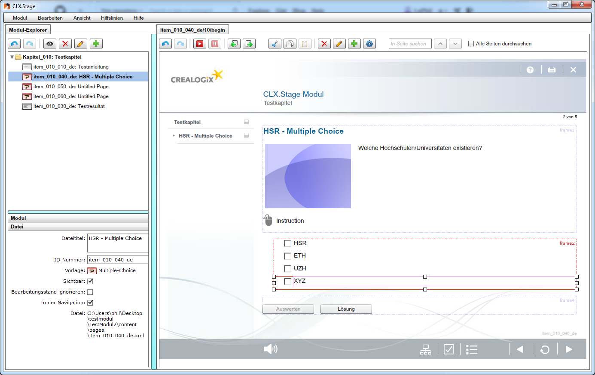
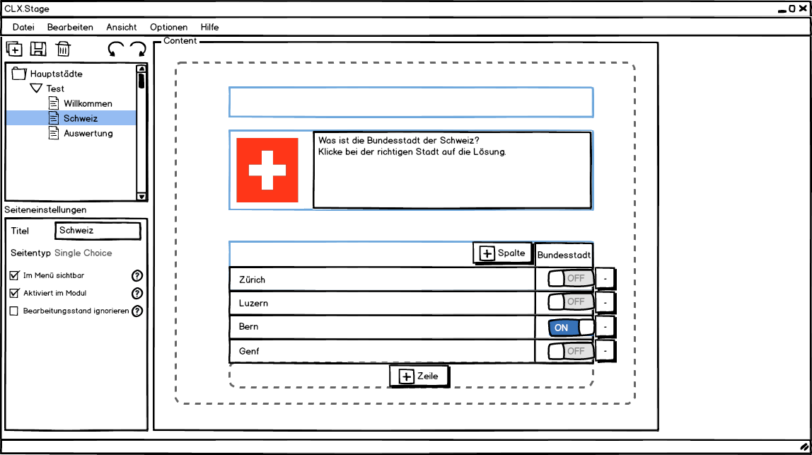
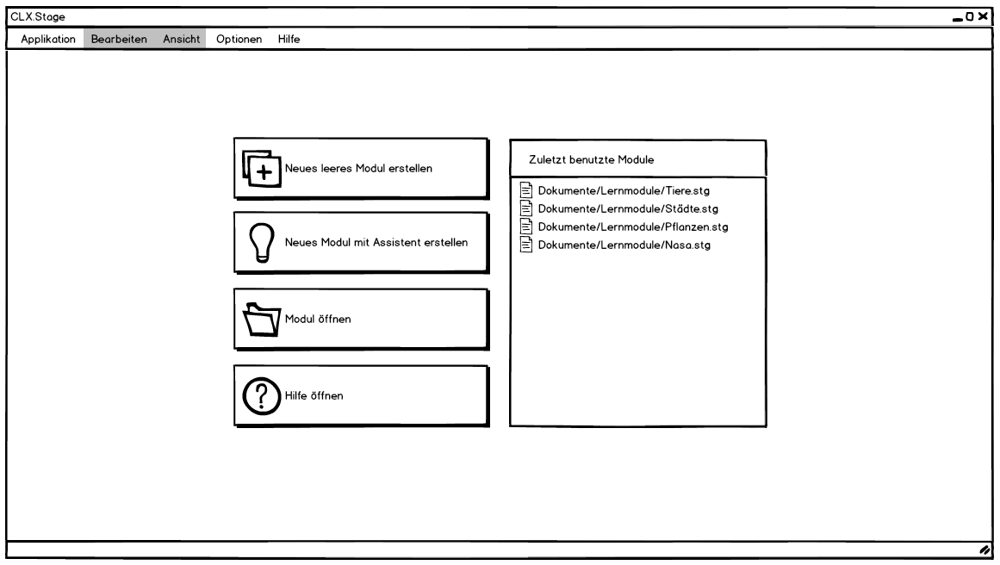
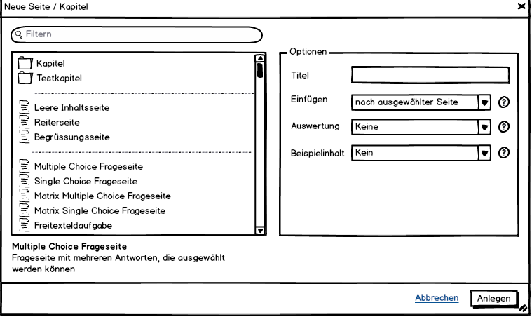
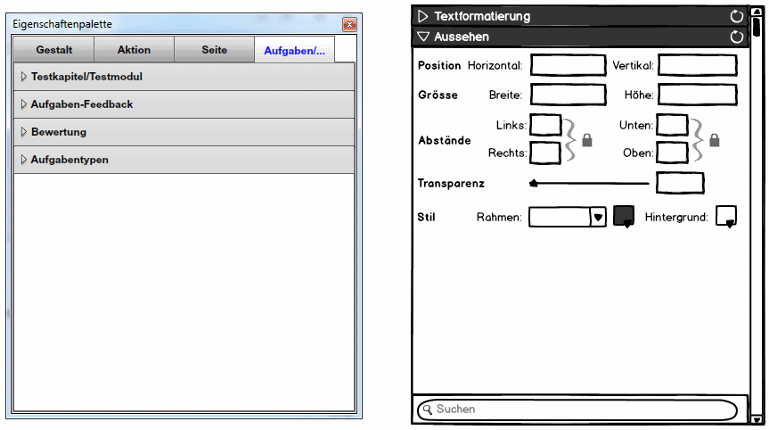
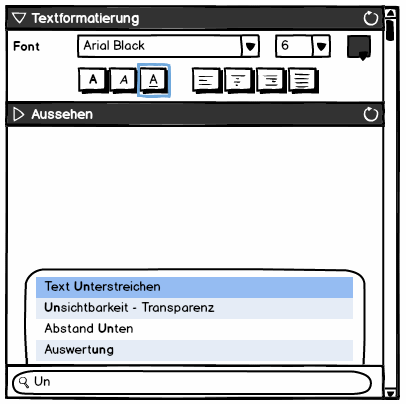
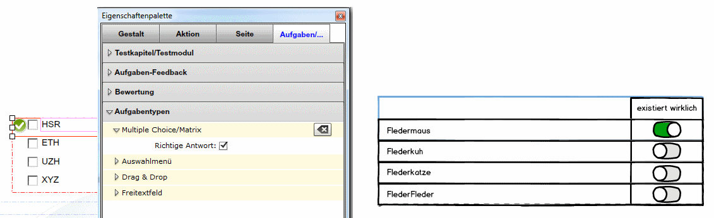
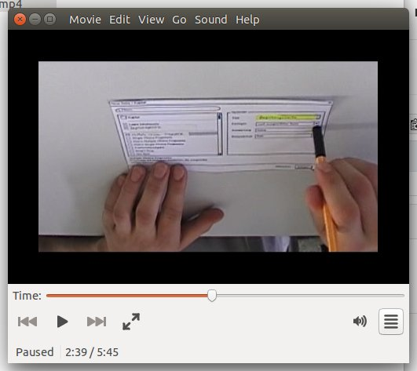
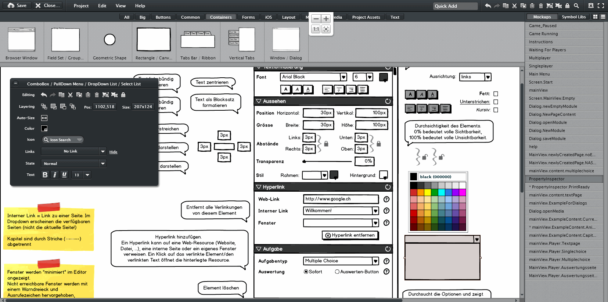
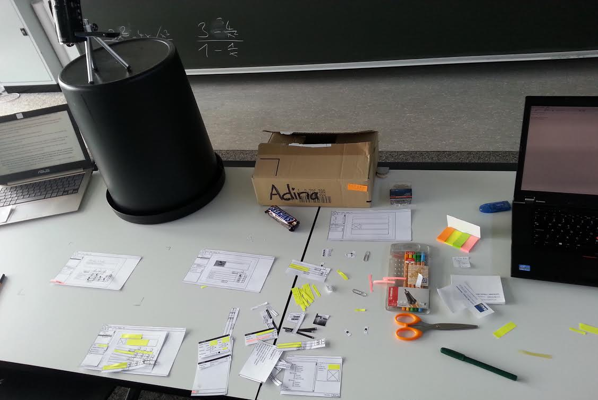

========================
UInt2 Miniprojekt Report
========================

.. * Wie weit sind wir?
.. * Was haben wir angeschaut in der ganzen App (Ausblick)
.. * Verbesserungen
.. * Wichtigste Ergebnisse / Erkenntnisse
.. * Wichtigste Fehler (bestätigt / nicht bestätigt / neue)
.. * Lessions learned
.. * Müsste man das redesign noch mal machen nachdem was wir gelernt haben bei den Tests der Redesigns?
.. * Was hat sich bewährt während dem Prototyping?
.. * Foto Projektaufbau & Screenshots

Einleitung
==========
CLX.Stage ist ein Autorentool der Firma Crealogix AG. Es ist ein WYSIWYG-Editor für Lernmodule und Tests im E-Learning-Bereich. Programmiert auf Basis von Adobe.AIR und in Actionscript.
Es bietet die Möglichkeit, in einem grafischen Editor Aufgaben- und Infoseiten zu erstellen und diese danach in einem integrierten Player oder einem externen HTML-Player (auch auf Mobile Devices) abzuspielen.
Über ein Tracking-System auf einem Server können Lernfortschritte verfolgt und ausgewertet werden.
CLX.Stage unterstützt neben den traditionellen Seitentypen wie Multiple Choice oder Text-Inputs auch modernere Methoden wie Drag and Drop oder Cloze-Tests.
Zusätzlich ist es möglich, Medien wie Audio- oder Film-Dateien einzubinden und abzuspielen sowie einfache, zeitgesteuerte Animationen zu erstellen.

.. was ist CLX.Stage und was ist ziel des projekts

Projektstand
============

Im Rahmen des Projektes wurden drei Redesigns für CLX.Stage durchgeführt.
Dabei wurden Teile der Hauptbereiche von CLX.Stage überarbeitet:

* Modul- und Seitenverwaltung
* Editor für Inhalte und Fragen
* Play-Modus

Die durchgeführten Redesigns decken einige wichtige Teile von CLX.Stage ab. 
Bereiche wie z.B. das Management von Vorlagen, das Hinzufügen zusätzlicher Elemente oder komplexere Seiten wie Drag'n'Drop wurden nicht überarbeitet, da das Primärziel des Redesigns die Verbesserung der User Experience für den Endanwender war und der Umfang dem Zeitplan entsprechen musste.

   Eine typische Ansicht in CLX.Stage.

   Eine ähnliche Situation mit dem neuen Design.

Vorgehen & Verbesserungen
=========================

Modul / Seiten erstellen
------------------------

Die komplexen und für den Benutzer teilweise unverständlichen Vorgänge zum Erstellen eines neuen 
Modules konnte durch einen verbesserten Prozess ersetzt werden, welcher den Benutzer führt, ihm jedoch auch die Möglichkeiten offen lässt, den Vorgang abzukürzen.
Eine grosse Schwachstelle im alten Design war, dass man sich nach dem Start des Programms auf einem leeren Schirm wiederfand und keine klaren nächsten Schritte vor Augen hatte.

   Der neue Startscreen mit Schnellzugriff auf zuletzt geöffnete Module und der Möglichkeit, schnell neue Module zu erstellen.

Weiterhin konnte der Benutzer bisher in bestimmten Abläufen Elemente auswählen, welche im aktiven Kontext keinen Sinn ergaben.
Dies führte im besten Fall zu Fehlermeldungen, wurde aber teilweise dem User nicht gemeldet. Neu werden dem Benutzer nur noch Elemente angezeigt, die er auch wirklich benutzen kann.

Ebenfalls werden dem Benutzer nur noch die Controls und Informationen angezeigt, die er benötigt.
So zeigte CLX.Stage dem Benutzer nach dem Start einige Controls (z.B. den Button für den Property Inspector) der Applikation, obwohl noch keine Seiten angelegt oder geladen wurd und entsprechend die Controls für Inhalte nicht benutzt werden können.

Das Erstellen von Kapiteln und Seiten wurde in einem Assistenten zusammengefasst.
Der Benutzer muss nicht mehr technische Unterscheidungen treffen, die ihn möglicherweise verwirren, sondern wählt im Assistent aus, was er benötigt. Zusätzlich wird hier dem Benutzer neu die Möglichkeit angeboten, verschiedene Beispielinhalte in die Seiten einzufügen oder nicht. Bisher wurde immer ein Beispielinhalt erstellt, was für erfahrene Benutzer eine Hürde darstellt, da jedes Mal der Inhalt gelöscht werden musste. Die Auswahl wird gespeichert, so dass ein Anfänger zu Beginn einen Beispielinhalt erhält, so dass er ein Gefühl für den Aufbau einer Seite erhält, später kann er diese Einstellung jedoch einfach deaktivieren und das Löschen umgehen.

   Redesign "Neue Seite erstellen" mittels Assistent

Inhalte Erstellen
-----------------

Einstellungen für die Seite und Eigenschaften von Inhaltselementen waren bei CLX.Stage an verschiedenen Orten untergebracht: Eigenschaften von Inhaltselementen in einer Toolbar oberhalb der Seite und Seiteneigenschaften sowie Einstellungen zu den Fragetypen in einer Sidebar. 
Der Benutzer musste genau wissen, was er wo findet. Neu befinden sich alle Eigenschaften in der Sidebar und werden abhängig vom ausgewählten Element und dem aktiven Kontext angezeigt. Es macht keinen Sinn, die Controls für Textformatierung anzuzeigen, wenn der Benutzer ein Bild markiert hat.

   Altes und neues Design Property Inspector

Zudem wurde noch eine Suche angedacht, welche die Bezeichnungen der verschiedenen Eigenschaften durchsucht und passende Elemente anzeigt. Wird etwa nach "Unterstreichen" gesucht, wird automatisch der Bereich "Textformatierung" angezeigt und der Button zum Unterstreichen von Text hervorgehoben.
Diese Suche war aber nicht Bestandteil der Usability-Tests.

   Suchfunktion im Property Inspector.

Das Erstellen und Bearbeiten von Fragen war für Benutzer ziemlich unverständlich, da die Editoren oft Elemente anzeigten, die der Benutzer gar nicht brauchte. 
Zudem war oft nicht klar, wo eine bestimmte Aktion zu finden war. Neu können einfache Operationen wie das Hinzufügen von Antworten inline im Element 
durchgeführt werden, alle Einstellungen befinden sich in der Sidebar.

   Setzen von richtigen Antworten vor und nach dem Redesign.

Usability-Test Resultate
========================

Die Resultate der Usability Tests zeigten, dass das neue UI die Probleme des alten UIs behob.
Keiner der Tester scheiterte in seinem Auftrag. Alle konnten die ihnen gestellten Ziele erreichen.

   Usability-Test am Paper-Prototyp

Während den Tests sind auch einige verbesserungswürdige Punkte am Redesign aufgetaucht. 
So enthielt das neu entwickelte UI einige Icons, welche die Benutzer verwirrten (Box mit Checkmark wurde als interaktive Checkbox anstatt als Symbol für eine Aufgabe interpretiert).

Auch über den Systemstatus waren sich die Benutzer nicht immer im klaren. Dies ist vor allem auf die Unterschiede des Papier-Prototyp gegenüber einem richtigen UI zurückzuführen, da der Papier-Prototyp komplexe Zustände wie Selektion, Hover oder die Unterscheidung Icons/Buttons/Formularelemente nicht immer verwechslungsfrei wiedergab.

Auf das Redesign zurückzuführende Probleme wurden für den finalen UI-Entwurf noch korrigiert.

Tools & Support
===============

Balsamiq Mockup
---------------

Als Mockup-Tool wurde "Balsamiq Mockups" verwendet.
Drafts für User Interfaces lassen sich schnell und einfach zusammenklicken und es bietet viele vorgefertigte Elemente mit Möglichkeit, Icons aus einer kleinen aber gut ausgewählten Bibliothek auszuwählen. Teilweise stösst man aber schnell an die Grenzen des Tools und muss entweder aus anderen Objekten das gewünschte Element zusammensetzen oder es in einem Bildeditor erstellen und dann als Image in Balsamiq importieren.
Als Prototyping Tool ist Balsamiq eher ungeeignet. Es lassen sich zwar Links zwischen einzelnen Mockups setzen, 
so dass ein Navigieren zwischen Mockups möglich ist, allerdings lassen sich interaktive Elemente wie Menüs oder Formularelemente nicht bedienen.
Somit wäre es erforderlich, dass für jeden Zustand von interaktiven Elementen das Mockup kopiert und angespasst würde, was bereits bei Änderungen am Layout sehr umfassende Anpassungen an vielen Mockups erfordert. 

Will man das Mockup auch für Prototyping verwenden, so ist man je nach Projekt mit einem HTML-Mockup oder einem anderen Tool besser bedient als Balsamiq.

   Balsamiq Mockups im Einsatz

Paper Prototyping vs. Tool Prototyping
--------------------------------------

Nach unseren Erfahrungen eignet sich Paper Prototyping nur noch bedingt zum Testen von Prototypen, da Paper Prototyping die heute üblichen interaktiven Elemente nicht repräsentativ wiedergeben kann.
Insbesondere Scroll-Elemente, Hover- und Active-Zustände, Markierungen, Animationen und interaktive Statussymbole können durch Paper Prototypes gar nicht oder nur mit sehr grossem Aufwand ansatzweise abgedeckt werden.

Vorgehen
========

Entwickelt wurde in Iterationen, um Erkenntnisse aus den ersten Redesigns und Usability-Tests in spätere einfliessen lassen zu können. Dabei folgten wir jeweils dem gleichen Schema: 

1) Definieren des Userziels für den jeweiligen Bereich
2) Entwerfen/Diskutieren eines passenden Workflows
3) Umsetzen als Mockups
4) Testen im Rahmen des Usability-Tests.

Dieses Vorgehen hat sich für alle Redesigns bewährt.

   Versuchsaufbau beim Testing.

Erkenntnisse ("Lessons Learned")
================================

* Balsamiq Mockup eignet sich zwar gut für Mockups, nicht jedoch für Prototyping Tests
* Wird ein neuer Workflow anhand des Benutzerziele und nicht so dass es irgendwie in eine bestehende Lösung passt entworfen, so ist der Workflow mit grosser Wahrscheinlichkeit einfacher und verständlicher
* Paper Prototyping eignet sich für moderne Applikationen nicht mehr, da es grosse Differenzen zum
  Verhalten und der User Experience der realen Applikation gibt
* Paper Prototyping ist sehr aufwendig und zeitintensiv
* Aufbau des Usability Tests, insbesondere der Videoaufnahme ausserhalb eines Usability-Labors ist
  eine komplizierte Angelegenheit und erfordert Improvisation
* Die Usability-Tests haben vor allem kleine Unstimmigkeiten des Redesigns hervorgebracht wie z.B.
  unpassend gewählte Icons. Ansonsten war das Redesign ein voller Erfolg.
* Mit bereits relativ wenig Aufwand kann ein Produkt mit suboptimaler UX deutlich verbessert werden.
* Um allzu aufwendiges "Basteln" zu verhindern, kann mit zugeschnittenen Post-Its eine vordefinierte Schreibfläche erzeugt werden, welche nach Gebrauch schnell ausgewechselt werden können und nicht einen neuen Ausdruck benötigt. Dies kann aber dazu führen, dass User nur auf die "gelben Zettel" achten und sonstige Interaktionselemente ausser Acht lassen.

Ausblick
========

Nach Abschluss der Projektes werden die Ergebnisse und Vorschläge für neue UIs den Verantwortlichen bei Crealogix präsentiert. Ob und wann die Resultate in das Produkt einfliessen, steht nicht in der Macht des Projektteams.
Es wäre aber durchaus interessant, Features, welche seit Beginn des Projekts wieder hinzugekommen sind, in die neuen Designs zu integrieren. Der Timing-Inspector bietet sich hier an, welcher eine "Zeitachse" einführt. Hier wurde aber entschieden, über sogenannte Steps auf der Zeitachse voranzuschreiten, was unserer Meinung nach nicht sehr benutzerfreundlich ist.
