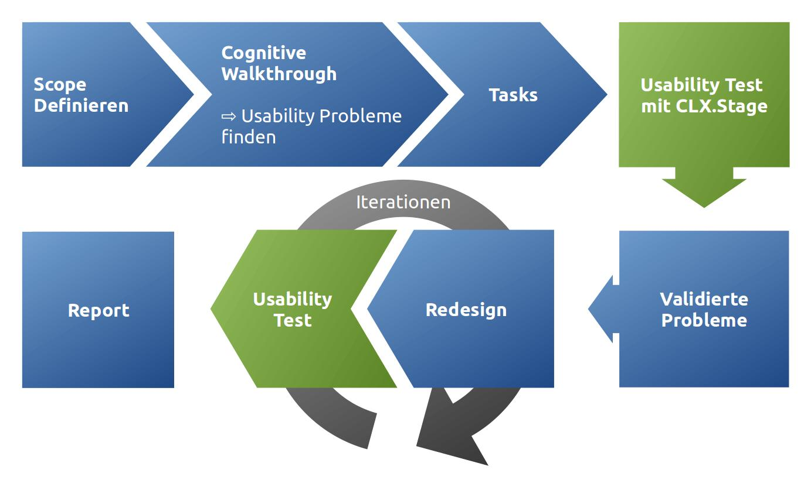
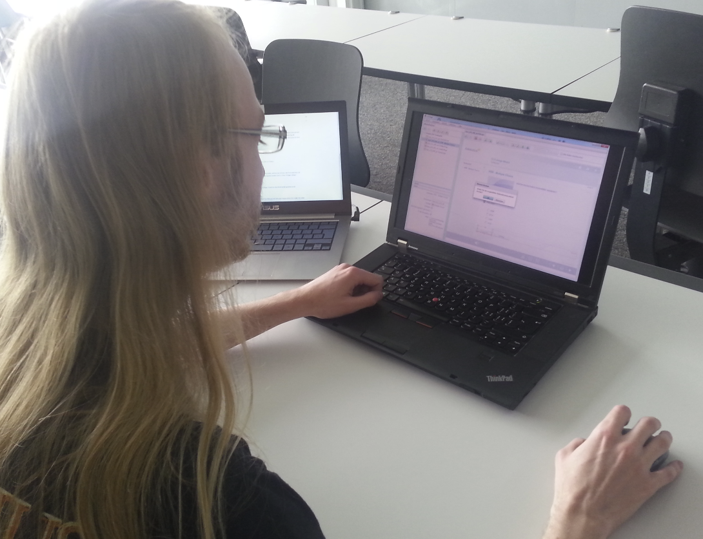
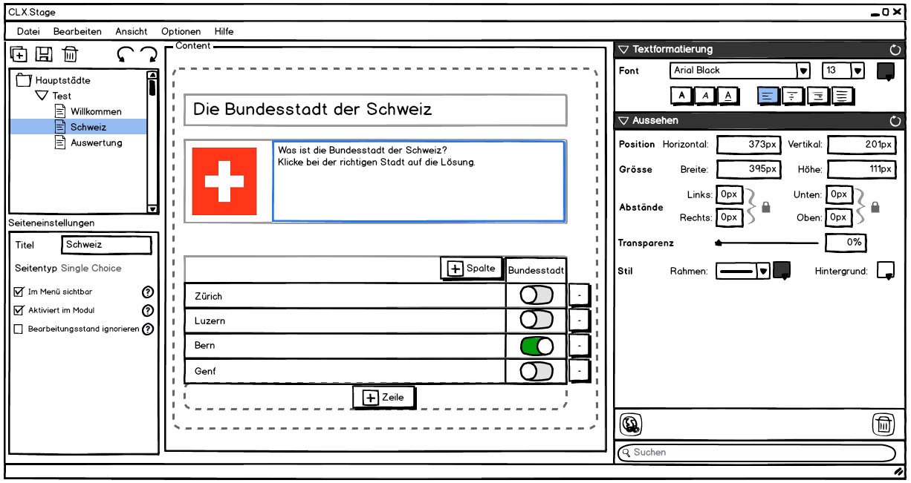

==================
CLX.Stage Redesign
==================

.. Compile information: rst2pdf UInt2Project-presentation.rst -b1 -s slides.style
   -b1 moves title on a new page

.. image:: http://edcabellon.com/wp-content/uploads/2010/06/website-redesign.jpg
   :align: center
   :width: 40 %

.. class:: center

Philipp Christen, Tobias Blaser

.. contents:: Inhalt
   :depth: 1

CLX.Stage
=========

.. image:: http://www.crealogix.com/fileadmin/customer/Produkte/Education_Produkte/header_clxstage_en.png
   :align: left
   :width: 60 %

* Crealogix AG
* E-Learning
* Erstellen und Durchführen von Lern- und Testmodulen
* Adobe.AIR + Flash
* WYSIWYG-Editor
* 1+1 Entwickler während ~15 Jahren (1 fix, 1 wechselnd)

Ausgangslage
------------

.. image:: ../stepScreens/3.1.2_6.Vorlagen_schliessen.png
   :align: center
   :width: 80 %

Vorgehen
========

   
   
.. Cognitive Walkthrough:
   * Bewertung nach Kriterien von Nielsen und Stone
   * 24 Probleme vermutet
   
.. Tasks:
   * 12 Tasks
   * 7 Tasks scheiterten -> Probleme validiert

.. raw:: pdf

   PageBreak
   
Projektscope
------------
   
*«Was wollen wir betrachten?»*

+-------------------------------------------------------------+-------------------------------------------------------------+-------------------------------------------------------------+
| Modul und Seiten                                            | Seiteninhalte                                               |  Modul abspielen                                            |
+-------------------------------------------------------------+-------------------------------------------------------------+-------------------------------------------------------------+
| .. figure:: ../stepScreens/3.0.Ausgangslage_Autor.png       | .. figure:: ../stepScreens/3.1.3_8_5.optionen_markieren.png | .. figure:: ../stepScreens/3.2.2-1.png                      |
|   :width: 4cm                                               |    :width: 4cm                                              |    :width: 4cm                                              |
|                                                             |                                                             |                                                             |
+-------------------------------------------------------------+-------------------------------------------------------------+-------------------------------------------------------------+
        

        
Usability-Tests (CLX.Stage)
===========================

*«Tauchen die Probleme überhaupt auf?»*

* 7 Probleme definitiv bestätigt
* Teilweise aus Zufall/Raten gelöst
* 4 neu aufgetauchte Probleme

      

.. Zuletzt benutzten Pfad nicht gemerkt
.. Neue Seite an falscher Position eingefügt
.. Zweiter Reiter in Kapitelvorlagen sehr unauffällig
.. Auto-Speichern verwirrt User

Redesign
========

*«Wie könnte es besser laufen?»*

.. Für bestätigte Probleme
.. Tool: Balsamiq Mockups

.. figure:: ../redesignedScreens/Screen.Start_cropped.png
   :width: 75 %
   :align: left
   
   Module / Seiten erstellen & verwalten
   

   
   Inhalte & Fragen editieren

Usability-Tests (Redesign)
==========================

*«Tauchen die Probleme immer noch auf?»*

.. Bild Versuchsaufbau

* Paper Prototypes
* Alle Probleme gelöst!
* 4 neue Probleme verursacht

.. image:: ../img/Versuchsaufbau.png
   :width: 50 %
   :align: right
   

.. Aktion "Seite öffnen" im Menu war ein Pfeil, wurde als "da hat's noch mehr Text" interpretiert
.. Im Dialog "Neue Seite erstellen" war Icon nicht ganz klar, wurde als Checkbox interpretiert
.. Unterschied Multiple-Choice/Single-Choice immer noch unklar
.. Play-Modus: Wie beenden?

Resultate
=========

*«Wie ist es gelaufen?»*

.. image:: ../img/UsabilityTestVideoFrame1.jpg
   :width: 50 %
   :align: right

.. Start-Screen wohl am eindrücklichsten

Fazit
=====

* Paper-Prototyping
	* Interessant, aber nicht geeignet für derart komplexe Applikation
	* viel Aufwand
  
* Balsamiq Mockups
	* Web-Lösung sehr angenehm, auch für Collaboration
	* super für einzelne Screens
	* grosse Lücken (Menu aufgeklappt --> neuer Screen)
	* besser HTML-Prototyp oder anderes Tool
  
* Gewähltes Produkt
	* gut, da nicht benutzerfreundlich
	* Eigeninitiative --> unklar ob Lösung eingesetzt wird
	* zu gross um alles in diesem Proekt umzusetzen
  
* relativ grosser Aufwand ( total ~60h Pro person )

.. raw:: pdf

   PageBreak

   
.. image:: http://upload.wikimedia.org/wikipedia/commons/thumb/1/1f/Gnome-dialog-question.svg/500px-Gnome-dialog-question.svg.png
   :align: center
   :height: 9 cm