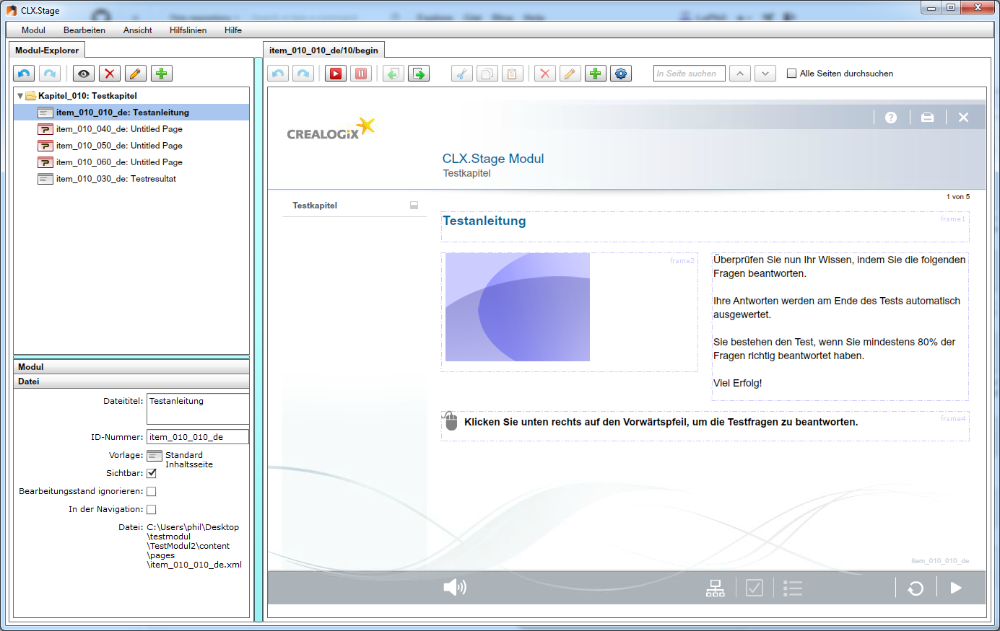

==================
CLX.Stage Redesign
==================

.. Compile information: rst2pdf UInt2Project-presentation.rst -b1 -s slides.style
   -b1 moves title on a new page

.. image:: http://edcabellon.com/wp-content/uploads/2010/06/website-redesign.jpg
   :align: center
   :width: 40 %

.. class:: center

Philipp Christen, Tobias Blaser

Ausgangslage
============

   
CLX.Stage
=========

.. image:: http://www.crealogix.com/fileadmin/customer/Produkte/Education_Produkte/header_clxstage_en.png
   :align: left
   :width: 75 %

* Crealogix AG
* E-Learning
* Erstellen und Durchführen von Lern- und Testmodulen
* Adobe.AIR + Flash
* WYSIWYG-Editor
* 1+1 Entwickler während ~15 Jahren (1 fix, 1 wechselnd)

Vorgehen
========

* Scope definieren
* Cognitive Walkthrough im Scope -> Usability-Probleme ermitteln
* Tasks erfasst, welche Problemzonen bestätigen sollen 
* Usability-Tests mit CLX.Stage
* 3 Iterationen Redesign + Usability-Test
* Fazit/Report
* Präsentation

Scope definieren
================

"Was wollen wir betrachten?"

3 Bereiche:

1) Modul und Seiten erstellen
2) Seiteninhalte erstellen
3) Modul abspielen

Cognitive Walkthrough
=====================

"Wo könnte es Probleme geben?

Kriterien von Nielsen und Stone beachtet
24 Probleme vermutet

Tasks
=====

"Wann werden die Probleme auftauchen?"
13 Tasks erstellt

Usability-Tests (1)
===================

"Tauchen die Probleme überhaupt auf?"

Mit CLX.Stage, 1 x HSR, 1 x CLX
7 Probleme definitiv bestätigt
teilweise aus Zufall/Raten gelöst
4 neu aufgetauchte Probleme
.. Zuletzt benutzten Pfad nicht gemerkt
.. Neue Seite an falscher Position eingefügt
.. Zweiter Reiter in Kapitelvorlagen sehr unauffällig
.. Auto-Speichern verwirrt User

Redesigns
=========

"Wie könnte es besser laufen?"

Für bestätigte Probleme
Tool: Balsamiq Mockups

Usability-Tests (2)
===================

"Tauchen die Probleme immer noch auf?"

.. Bild Versuchsaufbau
* Paper Prototypes
* Alle Probleme gelöst!
* 4 neue Probleme verursacht

.. Aktion "Seite öffnen" im Menu war ein Pfeil, wurde als "da hat's noch mehr Text" interpretiert
.. Im Dialog "Neue Seite erstellen" war Icon nicht ganz klar, wurde als Checkbox interpretiert
.. Unterschied Multiple-Choice/Single-Choice immer noch unklar
.. Play-Modus: Wie beenden?

Resultate
=========

"Wie ist es gelaufen?"

.. Start-Screen wohl am eindrücklichsten

Fazit
=====

* Paper-Prototyping
  * Interessant, aber nicht geeignet für derart komplexe Applikation
  * viel Aufwand
* Balsamiq Mockups
  * Web-Lösung sehr angenehm, auch für Collaboration
  * super für einzelne Screens
  * grosse Lücken (Menu aufgeklappt --> neuer Screen)
  * besser HTML-Prototyp oder anderes Tool
* Gewähltes Produkt
  * gut, da nicht benutzerfreundlich
  * Eigeninitiative --> unklar ob Lösung eingesetzt wird
  * zu gross um alles in diesem Proekt umzusetzen
* relativ grosser Aufwand ( total ~60h Pro person )

Fragen?
=======