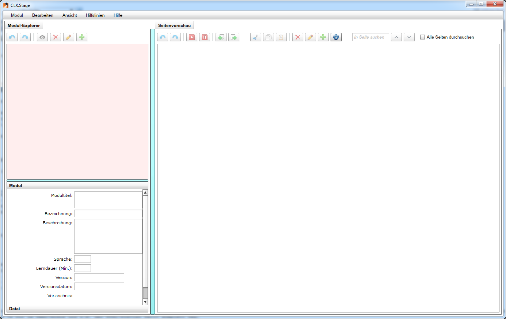
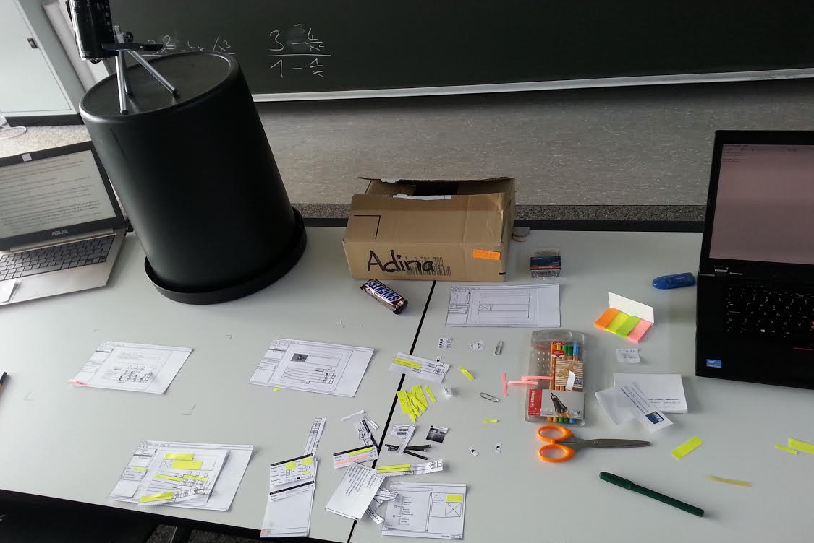
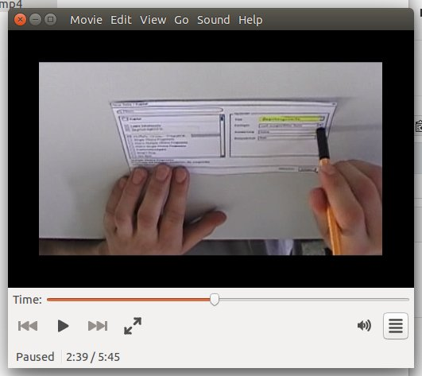

==================
CLX.Stage Redesign
==================

.. Compile information: rst2pdf UInt2Project-presentation.rst -b1 -s slides.style
   -b1 moves title on a new page

.. http://edcabellon.com/wp-content/uploads/2010/06/website-redesign.jpg

.. class:: center

Philipp Christen, Tobias Blaser

.. contents:: Inhalt
   :depth: 1

CLX.Stage
=========

.. http://www.crealogix.com/fileadmin/customer/Produkte/Education_Produkte/header_clxstage_en.png

* Crealogix AG
* WYSIWYG-Editor
* Erstellen und Durchführen von Lern- und Testmodulen
* E-Learning
* Adobe.AIR + Flash
* 20'000 LOC

Ausgangslage
------------

.. image:: ../stepScreens/3.1.2_6.Vorlagen_schliessen.png
   :align: center
   :width: 80 %

Vorgehen
========

   
   
.. Cognitive Walkthrough:
   * Bewertung nach Kriterien von Nielsen und Stone
   * 24 Probleme vermutet
   
.. Tasks:
   * 12 Tasks
   * 7 Tasks scheiterten -> Probleme validiert

.. raw:: pdf

   PageBreak
   
Projektscope
------------
   
*«Was wollen wir betrachten?»*

+-------------------------------------------------------------+-------------------------------------------------------------+-------------------------------------------------------------+
| Modul und Seiten                                            | Seiteninhalte                                               |  Modul abspielen                                            |
+-------------------------------------------------------------+-------------------------------------------------------------+-------------------------------------------------------------+
| .. figure:: ../stepScreens/3.0.Ausgangslage_Autor.png       | .. figure:: ../stepScreens/3.1.3_8_5.optionen_markieren.png | .. figure:: ../stepScreens/3.2.2-1.png                      |
|   :width: 4cm                                               |    :width: 4cm                                              |    :width: 4cm                                              |
|                                                             |                                                             |                                                             |
+-------------------------------------------------------------+-------------------------------------------------------------+-------------------------------------------------------------+
        

        
Usability-Tests (CLX.Stage)
===========================

*«Tauchen die Probleme überhaupt auf?»*

* 7 Probleme definitiv bestätigt
* Teilweise aus Zufall/Raten gelöst
* 4 neu aufgetauchte Probleme

.. image:: ../img/usability_test_clx_stage.png
      :height: 5cm
      :align: right
      

.. Zuletzt benutzten Pfad nicht gemerkt
.. Neue Seite an falscher Position eingefügt
.. Zweiter Reiter in Kapitelvorlagen sehr unauffällig
.. Auto-Speichern verwirrt User

Redesign
========

*«Wie könnte es besser laufen?»*

.. Für bestätigte Probleme
.. Tool: Balsamiq Mockups

.. figure:: ../redesignedScreens/Screen.Start_cropped.png
   :width: 75 %
   :align: left
   
   Redesign: Module / Seiten erstellen & verwalten
   
   
Redesign
========

   
   CLX.Stage: Module / Seiten erstellen & verwalten
   
   
Redesign
========

.. figure:: ../redesignedScreens/sidebar.png
   :width: 75 %
   :align: left
   
   Redesign: Inhalte & Fragen editieren
   
   
Redesign
========
   

   
   CLX.Stage: Inhalte & Fragen editieren
   
   
   
Usability-Tests (Redesign)
==========================

*«Tauchen die Probleme immer noch auf?»*

.. Bild Versuchsaufbau

* Paper Prototypes
* Alle Probleme gelöst!
* 4 neue Probleme verursacht

   

.. Aktion "Seite öffnen" im Menu war ein Pfeil, wurde als "da hat's noch mehr Text" interpretiert
.. Im Dialog "Neue Seite erstellen" war Icon nicht ganz klar, wurde als Checkbox interpretiert
.. Unterschied Multiple-Choice/Single-Choice immer noch unklar
.. Play-Modus: Wie beenden?

Resultate
=========

*«Wie ist es gelaufen?»*

* Enorme Verbesserung durch Redesign
	* Alle Usabilitytest-Ausgaben erfolgreich abgeschlossen
	
* Kleine Defizite während dem Test aufgetaucht
	* Unklare Icons
	* Differenzen Papierprototyp / Reales UI

.. Start-Screen wohl am eindrücklichsten

Fazit
=====

✗ relativ grosser Aufwand ( total ~60h Pro person )

**Paper-Prototyping**

✗ Nicht geeignet für moderne, interaktive UI's -> zuviel Aufwand

  
**Balsamiq Mockups (Web-Lösung)**

✔ Gut für Mockups / einzelne Screens

✗ Ungeeignet zum Testen der Applikation (keine interaktiven Elemente)
  

**Ausblick**

✗ Unklar ob Lösung umgesetzt wird
  

.. raw:: pdf

   PageBreak

   
.. http://upload.wikimedia.org/wikipedia/commons/thumb/1/1f/Gnome-dialog-question.svg/500px-Gnome-dialog-question.svg.png
 
